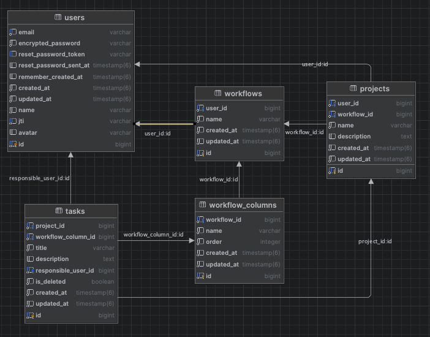

# Task Manager Metatate Challenge

This is a challenge project from Metatate and consists of creating a Kanban-style task management system.

## Stack

- Ruby version 2.7.2
- Rails version 7.1.3
- PostgreSQL
- ReactJs 11.11.4
- NodeJs (20.11.0)
- npm (10.2.4)

## Prerequisites

- Docker
- Docker compose

## Installation

```bash
git clone git@github.com:jefersonkrauss/metatate_challenge.git
cd metatate_challenge
docker compose up -d
```

### After running the development servers, the project should be accessible at
- Frontend `http://localhost:3000`
- Backend `http://localhost:3001`

## Usage

Open your browser and visit `http://localhost:3001` to see the application running.

### You can log in with the test user below:

* email: admin@example.com
* password: 12345678

## Backend Apis

### To import the Postman files, follow these steps:

1. In the Postman menu bar, click on File.
2. Select Import....
3. Navigate to the location of the exported files from Postman in the root folder of your project.
4. Choose the files bellow: 
   * `Task_Manager_Challenge.postman_collection.json`
   * `Task_Manager_Challenge_Dev.postman_environment.json`
5. Click Open or Import to import the selected files.
6. You should now see the imported collections and environment variables in the left sidebar of Postman.

## ER Diagram

